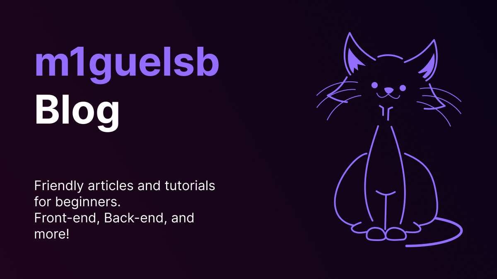

<p align="center">
  <a href="https://m1guelsb.com">
    
  </a>
</p>
<p align="center">
  

  

  

  

  
</p>

## About 🔎
My personal blog and portfolio. Writing about front-end, back-end, design and technology in general.

---
## Articles List 📝
- [React Beginner Mistakes](https://m1guelsb.com/blog/erros-comuns-de-iniciantes-em-reactjs)
- [How to handle Spring boot exceptions](https://m1guelsb.com/blog/como-tratar-erros-no-spring-boot)

---
## Tech Stack 🔧
<p>
  
  
  
  
</p>

---
## How to run 🏃
```
npm i
npm run dev
```
